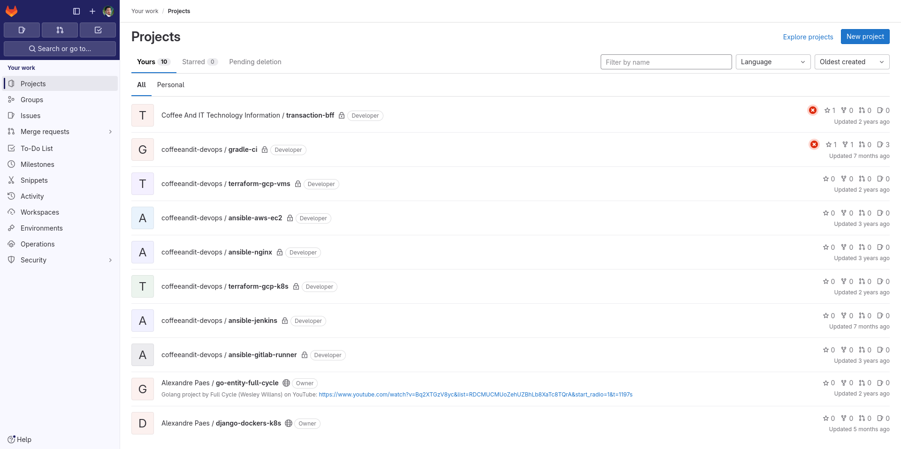

# bix-django-challenge
This is a simple Hotel Reservation and Management Backend Software as part of the code challenge for an opportunity at Biz Technology.

### A django project in production on heroku I built
1. [A Django Project](adequa-lgpd.app.br)
2. [Another Django Project](https://adequa-lgpd-alexandrepaes-80ad9dd83428.herokuapp.com/home/institucional/)
3. [Another Django Project](https://adequa-lgpd-alexandrepaes-80ad9dd83428.herokuapp.com/home/casadomib/)

### A few more repos in case it's needed
1. [My Main Github](https://github.com/LondonComputadores?tab=repositories)
2. [Gitlab For My DevOps Projects](https://gitlab.com/LondonComputadores)

##### Gitlab Projects' images from loggged in user

